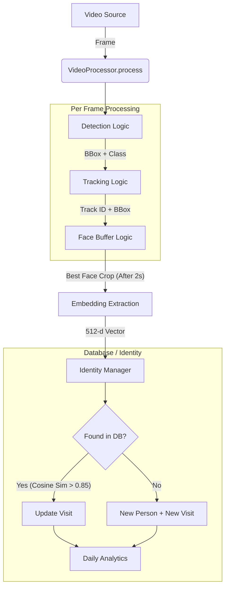

# Platform Architecture & Detailed Logic

This document provides a comprehensive technical overview of the diamond store video analytics platform. It details the pipeline from video ingestion to identity resolution, including the specific algorithms and mathematics used in each layer.

## 1. High-Level Architecture Diagram

The system operates as a real-time linear pipeline processing video frames.

---

## 2. Platform Information

The system runs on a **Linux** environment and leverages the following core technologies:

| Component | Technology | Version | Description |
|-----------|------------|---------|-------------|
| **Language** | Python | 3.12 | Core logic implementation. |
| **Orchestration** | FastAPI | 0.128.0 | Web server/streaming interface. |
| **Detection** | Ultralytics YOLO | 8.4.5 | Model: `yolo11n.pt` (Nano). Warning: Class 0 (Person) is filtered. |
| **Tracking** | DeepSort | 1.3.2 | Real-time multi-object tracking. |
| **Face Rec** | InsightFace | 0.7.3 | Embedding generation. Model Pack: `buffalo_l`. |
| **Math** | SciPy / NumPy | 1.17 / 2.2 | Vector mathematics (Cosine distance). |
| **Database** | PostgreSQL | 15+ | Relational data. |
| **Vector DB** | pgvector | 0.4.2 | PostgreSQL extension for vector storage/search. |
| **ORM** | SQLAlchemy | 2.0.45 | Database abstraction. |

---

## 3. Detailed Logic & Mathematics

### A. Detection Layer (`app/video/video_processor.py`)
- **Input**: Raw video frame (BGR).
- **Algorithm**: YOLO11 Nano (`yolo11n.pt`).
- **Confidence Threshold**: `0.5` (50%).
- **Logic**:
  - Runs inference on the full frame.
  - Filters results for **Class ID 0** ("person").
  - Filters out detections with confidence score < 0.5 to eliminate false positives (e.g., shadows, occlusions).
  - **Output**: List of bounding boxes `[x, y, w, h]` and confidence scores for high-confidence person detections.

### B. Tracking Layer (`app/video/video_processor.py`)
- **Algorithm**: DeepSort (`deep_sort_realtime`).
- **Configuration**: `max_age=30` frames.
- **Logic**:
  - Assigns a unique `track_id` to each detected person.
  - Uses Kalman Filters to predict positions and handle occlusions.
  - **Lifecycle**: A "Track" persists as long as the person is matched across frames. If tracking is lost for >30 frames (approx 1s at 30fps), the ID is discarded.
- **Output**: Confirmed Tracks with IDs and LTRB (Left, Top, Right, Bottom) coordinates.

### C. Video Buffer Logic (`app/video/face_buffer.py`)
This layer ensures quality control by verifying a person is present for a minimum duration and selecting their "best" angle before attempting recognition.

- **Objective**: Prevent processing blurry/partial faces immediately; wait for a clear shot.
- **Parameters**: `observe_seconds = 2.0`.
- **Logic (Per Track ID)**:
  1.  **Start**: When a `track_id` is first seen, initialize a buffer. Record `start_time` and the current face image's `score` (detection confidence).
  2.  **Update**: For subsequent frames, if the new face detection score is higher than the stored `best_score`, update the `best_face`.
  3.  **Lock & Release**:
      - Check condition: `(current_time - start_time) >= 2.0 seconds`.
      - **Trigger**: If true, return the `best_face` (image crop) and mark the track as `locked`.
      - **Post-Lock**: Future frames for this `track_id` are ignored by the recognition pipeline to prevent duplicate processing for the same track.

### D. Embedding & Cosine Similarity (`app/face/insightface_embedder.py`)
- **Model**: `buffalo_l` (InsightFace).
- **Process**:
  1.  Takes the `best_face` crop from the buffer.
  2.  Detects the face *within* that person crop (refining the bounding box).
  3.  Aligns the face using landmarks.
  4.  Extracts a 512-dimension feature vector.
- **Mathematics**:
  - The output vector $v$ is **L2-Normalized**:
    $$ ||v||_2 = \sqrt{\sum v_i^2} = 1 $$

### E. Visit Session Logic (`app/services/identity_manager.py`)
This layer determines if the person is a new visitor, a returning customer, or currently in an active session.

#### 1. Identification (Matching)
- **Math**: Cosine Similarity.
- **Formula**:
  $$ \text{Similarity} = 1 - \text{CosineDistance}(A, B) = 1 - \frac{A \cdot B}{||A|| ||B||} $$
  *(Since vectors are normalized, this simplifies to just the Dot Product).*
- **Threshold**: `FACE_SIMILARITY_THRESHOLD = 0.85`.
- **Logic**:
  - Compare new embedding against **all** stored `Person` embeddings.
  - Find the candidate with the maximum similarity score.
  - if $MaxScore < 0.85$: **Unknown Person**.
  - if $MaxScore \ge 0.85$: **Match Found**.

#### 2. Session Management (The "20-Minute Rule")
- **Parameter**: `REENTRY_TIME_MINUTES = 20`.
- **Scenario A: Unknown Person**:
  - Create new `Person` record in DB with `visit_count = 1`, `daily_visit_count = 1`.
  - Create new `Visit` record (`start=now`, `end=now`).
  - Update Analytics: `total_flow + 1`, `unique_count + 1`.
- **Scenario B: Known Person**:
  - Fetch their **last visit**.
  - Check Gap: `TimeDelta = CurrentTime - LastVisit.EndTime`.
  - **Case 1: Re-entry** (`TimeDelta > 20 mins`):
      - Treat as a fresh visit.
      - Create new `Visit` entry.
      - Increment `visit_count += 1` (lifetime counter).
      - Update `daily_visit_count`:
        - If `last_visit_date != today`: Reset to `daily_visit_count = 1`.
        - If `last_visit_date == today`: Increment `daily_visit_count += 1`.
      - Update `last_visit_date = today`.
      - Update Analytics: `total_flow + 1`, `unique_count + 1`.
  - **Case 2: Ongoing Visit** (`TimeDelta <= 20 mins`):
      - Update only the `end_time` of the existing `Visit` to `now`.
      - Do *not* increment any counters or analytics.

**Visit Count Tracking:**
- `visit_count`: Incremented every time a known person re-enters (gap > 20 mins). Example: Person enters → visit_count=1. Returns after 21 mins → visit_count=2.
- `daily_visit_count`: Tracks visits within a single day. Resets at midnight. Example: Person enters twice on Jan 23 → daily_visit_count=2. On Jan 24, first entry → daily_visit_count=1.

## 4. Storage Schema (`app/db/models.py`)

- **Person**:
  - `id`: UUID.
  - `face_embedding`: 512-float vector (`pgvector`).
  - `name_label`: String (default "Unknown").
  - `first_seen`: DateTime of first detection.
  - `last_seen`: DateTime of most recent detection.
  - `visit_count`: Integer - Total lifetime visits (incremented on re-entry).
  - `daily_visit_count`: Integer - Visits today (resets daily).
  - `last_visit_date`: Date - Date of last visit (used to detect day changes).

- **Visit**:
  - Links to `Person`.
  - `start_time`, `end_time`: Tracks session duration.

- **DailyAnalytics**:
  - `day`: Date.
  - `total_flow`: Raw entry count.
  - `unique_count`: Distinct visit sessions started.
